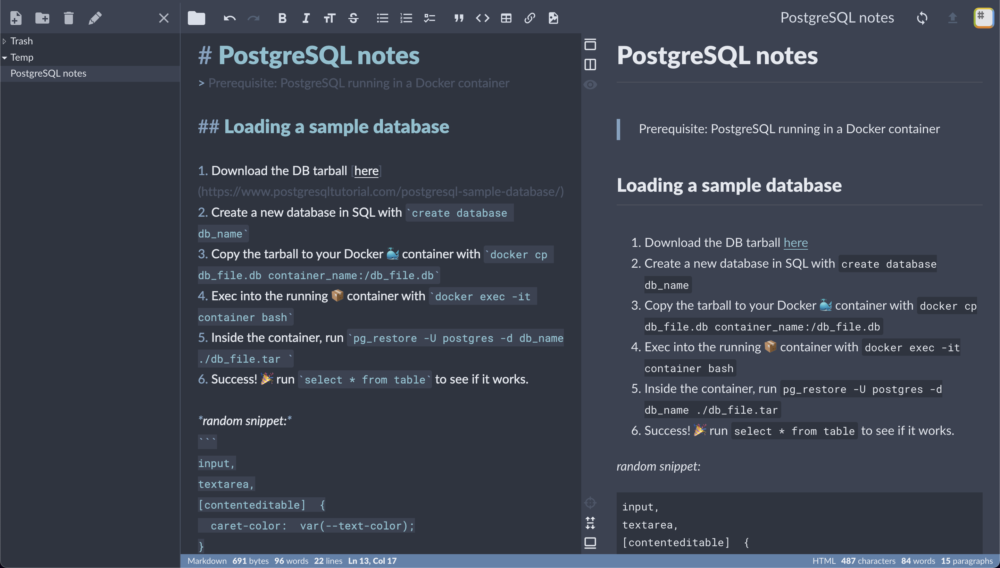

# StackEdit Nord

A theme for StackEdit, using the polar color palette [Nord](https://www.nordtheme.com/).

Utilizing the power of CSS Variables, the colors can be adjusted to fit your own color theme.
